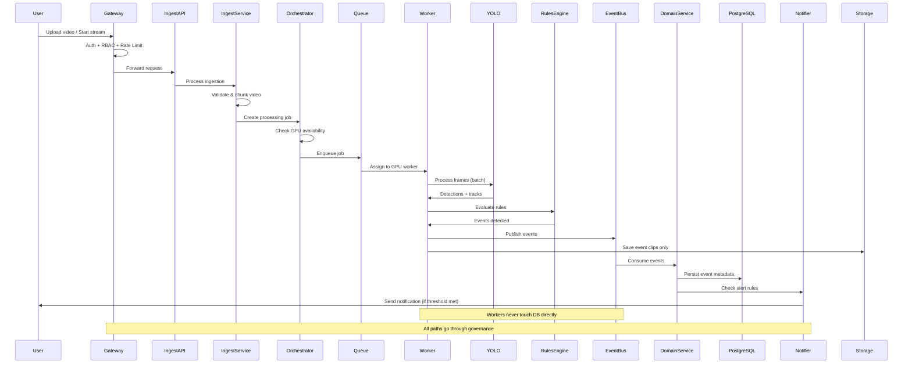
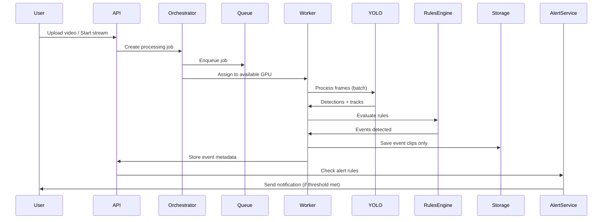

# Enterprise Video Intelligence Platform - Architecture Plan

## System Overview

**Architecture Type**: Distributed, near real-time video processing system with event-clip-only storage
**GPU Strategy**: Distributed GPUs across multiple machines
**Processing Priority**: Near real-time (minimal delay)
**Storage Strategy**: Event clips only (no full video retention)

## High-Level Architecture

```mermaid
graph TB
    subgraph "Frontend Layer"
        UI[React + TypeScript UI]
    end
    
    subgraph "API Gateway Layer"
        Gateway[API Gateway]
        Auth[Auth Service]
        RBAC[RBAC Middleware]
        RateLimit[Rate Limiter]
        Audit[Audit Logger]
    end
    
    subgraph "API Services"
        APICore[FastAPI Core Services]
        IngestAPI[Ingestion API]
        EventAPI[Event API]
        AlertAPI[Alert API]
    end
    
    subgraph "Ingestion Service"
        IngestService[Video Ingest Service]
        StreamHandler[RTSP/HTTP Handler]
        UploadHandler[File Upload Handler]
        Chunker[Video Chunker]
    end
    
    subgraph "Orchestration Layer"
        Orchestrator[Job Orchestrator<br/>Coordination Only]
        Scheduler[Task Scheduler]
        GPUMgr[GPU Resource Manager]
    end
    
    subgraph "Message Infrastructure"
        RedisQueue[Redis: Task Queue]
        RedisCache[Redis: Cache]
        RedisCoord[Redis: Coordination]
        DLQ[Dead Letter Queue]
    end
    
    subgraph "Worker Layer - Distributed"
        Worker1[GPU Worker 1]
        Worker2[GPU Worker 2]
        WorkerN[GPU Worker N]
    end
    
    subgraph "ML Pipeline"
        YOLO[YOLO11 Inference]
        Tracking[Object Tracking]
        RulesEngine[Rules Engine<br/>Event Evaluation]
    end
    
    subgraph "Event Bus"
        EventBus[Event Bus/Message Queue]
    end
    
    subgraph "Domain Services"
        DomainEvents[Events Domain Service]
        DomainAlerts[Alerts Domain Service]
        DomainCameras[Cameras Domain Service]
        DomainRules[Rules Domain Service]
    end
    
    subgraph "Data Layer"
        PostgreSQL[(PostgreSQL)]
        Storage[Event Clip Storage]
    end
    
    subgraph "Observability Layer"
        Prometheus[Prometheus<br/>Metrics]
        OpenTelemetry[OpenTelemetry<br/>Tracing]
        Logging[Structured Logging<br/>Loki/ELK]
    end
    
    subgraph "Notification Service"
        Notifier[Notification Service]
        Email[Email SMTP]
        Webhook[Webhook Dispatcher]
        InApp[In-App Alerts]
    end
    
    UI -->|HTTPS| Gateway
    Gateway --> Auth
    Gateway --> RBAC
    Gateway --> RateLimit
    Gateway --> Audit
    
    Gateway --> APICore
    Gateway --> IngestAPI
    Gateway --> EventAPI
    Gateway --> AlertAPI
    
    IngestAPI --> IngestService
    IngestService --> StreamHandler
    IngestService --> UploadHandler
    IngestService --> Chunker
    
    IngestService -->|Create Job| Orchestrator
    APICore -->|Query/Config| DomainEvents
    APICore -->|Query/Config| DomainAlerts
    APICore -->|Query/Config| DomainCameras
    APICore -->|Query/Config| DomainRules
    
    Orchestrator --> GPUMgr
    GPUMgr -->|Check Availability| RedisCoord
    Orchestrator -->|Enqueue| RedisQueue
    Scheduler -->|Scheduled Jobs| RedisQueue
    
    RedisQueue -->|Pull Task| Worker1
    RedisQueue -->|Pull Task| Worker2
    RedisQueue -->|Pull Task| WorkerN
    RedisQueue -->|Failed Jobs| DLQ
    
    Worker1 -->|Load Model| YOLO
    Worker2 -->|Load Model| YOLO
    WorkerN -->|Load Model| YOLO
    
    YOLO -->|Detections| Tracking
    Tracking -->|Tracks| RulesEngine
    RulesEngine -->|Events| EventBus
    
    Worker1 -->|Write Clips| Storage
    Worker2 -->|Write Clips| Storage
    WorkerN -->|Write Clips| Storage
    
    EventBus -->|Event Messages| DomainEvents
    EventBus -->|Event Messages| DomainAlerts
    
    DomainEvents -->|Persist| PostgreSQL
    DomainAlerts -->|Persist| PostgreSQL
    DomainCameras -->|Persist| PostgreSQL
    DomainRules -->|Persist| PostgreSQL
    
    DomainAlerts -->|Trigger| Notifier
    Notifier --> Email
    Notifier --> Webhook
    Notifier --> InApp
    
    APICore -->|Read Cache| RedisCache
    DomainEvents -->|Read Cache| RedisCache
    Orchestrator -->|State| RedisCoord
    
    Gateway -->|Metrics| Prometheus
    APICore -->|Metrics| Prometheus
    Worker1 -->|Metrics| Prometheus
    Worker2 -->|Metrics| Prometheus
    WorkerN -->|Metrics| Prometheus
    Orchestrator -->|Metrics| Prometheus
    
    Gateway -->|Traces| OpenTelemetry
    APICore -->|Traces| OpenTelemetry
    Worker1 -->|Traces| OpenTelemetry
    Worker2 -->|Traces| OpenTelemetry
    Orchestrator -->|Traces| OpenTelemetry
    
    Gateway -->|Logs| Logging
    APICore -->|Logs| Logging
    Worker1 -->|Logs| Logging
    Worker2 -->|Logs| Logging
    Orchestrator -->|Logs| Logging
    RulesEngine -->|Logs| Logging
```



## Architectural Improvements & Design Decisions

### 1. API Gateway Layer (Separation of Concerns)

**Problem Solved**: Previously, API handled both business logic and gateway concerns.

**Solution**: Explicit API Gateway layer with:
- **Auth Service**: JWT validation, token refresh
- **RBAC Middleware**: Role-based access control enforcement
- **Rate Limiter**: Prevents abuse, protects backend
- **Audit Logger**: All requests logged for compliance

**Benefits**:
- Single point for security policies
- Easier to add WAF, DDoS protection later
- Clear separation: gateway vs. business logic

### 2. Ingestion Service (Decoupled from Orchestrator)

**Problem Solved**: Orchestrator was overloaded with ingestion responsibilities.

**Solution**: Dedicated **Ingestion Service** that:
- Handles RTSP/HTTP streams and file uploads
- Validates input (auth, rate limits via gateway)
- Chunks video into processable segments
- Creates jobs and sends to orchestrator

**Benefits**:
- Ingestion can scale independently
- Orchestrator focuses only on coordination
- Easier to add new ingestion sources (S3, Azure Blob, etc.)

### 3. Workers Write to Event Bus (Not Directly to DB)

**Problem Solved**: Workers writing directly to PostgreSQL causes:
- Schema coupling
- Write contention
- Security risk (DB creds on GPU nodes)
- Hard to enforce invariants

**Solution**: **Event Bus pattern**:
- Workers publish events to message queue (Redis/RabbitMQ)
- Domain services consume events and persist to PostgreSQL
- Workers are compute-heavy, not state-heavy

**Benefits**:
- Workers remain stateless and scalable
- Event replay capability
- Better error handling and retries
- Clear separation: compute vs. persistence

### 4. Redis Logical Separation

**Problem Solved**: Single Redis instance used for everything = debugging nightmare.

**Solution**: Three logical Redis namespaces:
- **Redis Queue**: Task queue (Celery/RQ compatible)
- **Redis Cache**: Application cache (query results, configs)
- **Redis Coordination**: Orchestrator state, GPU availability, locks

**Implementation**: Use Redis databases (0, 1, 2) or key prefixes, can be same cluster initially.

**Benefits**:
- Clear separation of concerns
- Independent scaling later
- Easier debugging and monitoring

### 5. Orchestrator Focus: Coordination Only

**Problem Solved**: Orchestrator was doing ingestion, scheduling, caching, and coordination.

**Solution**: Orchestrator now only:
- Coordinates job distribution
- Manages GPU resource allocation (via GPU Manager)
- Enqueues jobs to task queue
- Tracks job state

**Separate Components**:
- **Scheduler**: Handles cron-based scheduled jobs
- **GPU Manager**: Tracks GPU availability, health
- **Ingestion Service**: Handles video input (separate)

**Benefits**:
- Single responsibility principle
- Easier to test and scale
- Reduced failure blast radius

### 6. Rules Engine Placement (In Worker Pipeline)

**Problem Solved**: Unclear where rules execute.

**Solution**: Rules Engine runs **inside worker pipeline**:
```
YOLO → Tracking → Rules Engine → Events → Event Bus
```

**Why**: 
- Rules need access to detection results and temporal context
- Keeps workers self-contained
- Rules can be GPU-accelerated if needed (future)

**Benefits**:
- Low latency (no network hop)
- Temporal analysis possible (frame sequences)
- Rules can be updated without API changes

### 7. Observability as First-Class Citizen

**Problem Solved**: Observability was an afterthought, making debugging impossible at scale.

**Solution**: Explicit **Observability Layer**:
- **Prometheus Metrics**: GPU usage, processing latency, event rates, queue depth
- **OpenTelemetry Tracing**: Distributed tracing across API → Orchestrator → Worker
- **Structured Logging**: JSON logs to Loki/ELK, searchable and filterable

**All Components Emit**:
- Gateway, API, Workers, Orchestrator, Rules Engine

**Benefits**:
- Debug GPU job hangs
- Track why alerts didn't fire
- Monitor system health proactively
- Compliance audit trails

### 8. Failure Handling (Dead Letter Queue)

**Problem Solved**: Diagram showed happy path only.

**Solution**: Explicit failure handling:
- **Dead Letter Queue (DLQ)**: Failed jobs after max retries
- **Retry Policy**: Exponential backoff for transient failures
- **Job Timeouts**: Prevent hung GPU jobs
- **Circuit Breakers**: Stop sending jobs to unhealthy workers

**Benefits**:
- No silent failures
- Failed jobs can be inspected and reprocessed
- System degrades gracefully

### 9. Notification Service (Decoupled)

**Problem Solved**: Alert logic mixed with event processing.

**Solution**: Dedicated **Notification Service**:
- Consumes alerts from domain service
- Handles throttling and deduplication
- Dispatches to multiple channels (Email, Webhook, In-App)
- Manages notification preferences

**Benefits**:
- Easy to add new notification channels
- Centralized alert logic
- Better testing and monitoring

## Data Flow: Complete Request Lifecycle



## Folder Structure

```
workflow-monitoring/
├── frontend/                          # React + TypeScript frontend
│   ├── src/
│   │   ├── components/                # Reusable UI components
│   │   │   ├── ui/                    # ShadCN UI components
│   │   │   ├── dashboard/            # Dashboard components
│   │   │   ├── events/                # Event-related components
│   │   │   ├── cameras/               # Camera management
│   │   │   ├── alerts/                # Alert management
│   │   │   └── reports/               # Report builder
│   │   ├── hooks/                     # React hooks
│   │   ├── lib/                       # Utilities, API client
│   │   ├── contexts/                  # React contexts (auth, theme)
│   │   ├── pages/                     # Page components
│   │   └── types/                     # TypeScript types
│   ├── public/
│   ├── package.json
│   └── tsconfig.json
│
├── backend/
│   ├── gateway/                        # API Gateway layer
│   │   ├── middleware/
│   │   │   ├── auth.py                # JWT validation
│   │   │   ├── rbac.py                # Role-based access control
│   │   │   ├── rate_limit.py          # Rate limiting
│   │   │   └── audit.py               # Request audit logging
│   │   └── router.py                  # Gateway routing
│   │
│   ├── app/                            # FastAPI application (API services)
│   │   ├── main.py                    # FastAPI app entry
│   │   ├── api/
│   │   │   ├── v1/
│   │   │   │   ├── auth.py            # Authentication endpoints
│   │   │   │   ├── cameras.py         # Camera management
│   │   │   │   ├── events.py          # Event queries
│   │   │   │   ├── alerts.py          # Alert management
│   │   │   │   ├── reports.py         # Report generation
│   │   │   │   ├── rules.py           # Rule configuration
│   │   │   │   └── ingestion.py       # Ingestion API endpoints
│   │   │   └── dependencies.py        # Shared dependencies (auth, DB)
│   │   ├── core/
│   │   │   ├── config.py              # Configuration management
│   │   │   ├── security.py            # JWT, password hashing
│   │   │   └── database.py            # Database connection
│   │   └── middleware/
│   │       └── cors.py                # CORS configuration
│   │
│   ├── ingestion/                      # Video ingestion service
│   │   ├── service.py                  # Ingestion service
│   │   ├── handlers/
│   │   │   ├── rtsp_handler.py         # RTSP stream handler
│   │   │   ├── http_handler.py        # HTTP stream handler
│   │   │   └── upload_handler.py       # File upload handler
│   │   ├── chunker.py                  # Video chunking logic
│   │   └── validator.py                 # Input validation
│   │
│   ├── worker/                         # GPU inference runtime (separate)
│   │   ├── main.py                     # Worker entry point
│   │   ├── inference/
│   │   │   ├── yolo_engine.py         # YOLO11 wrapper
│   │   │   ├── tracker.py             # Object tracking
│   │   │   └── frame_processor.py     # Frame processing logic
│   │   ├── rules/
│   │   │   └── engine.py              # Rules engine (runs in worker)
│   │   ├── video/
│   │   │   └── clip_extractor.py      # Event clip extraction
│   │   └── tasks/
│   │       ├── process_video.py       # Video processing task
│   │       └── event_detector.py     # Event detection pipeline
│   │
│   ├── domain/                         # Business logic layer
│   │   ├── events/
│   │   │   ├── service.py             # Event domain service
│   │   │   └── repository.py         # Event data access
│   │   ├── alerts/
│   │   │   ├── service.py             # Alert domain service
│   │   │   └── repository.py         # Alert data access
│   │   ├── cameras/
│   │   │   ├── service.py             # Camera domain service
│   │   │   └── repository.py         # Camera data access
│   │   └── rules/
│   │       ├── service.py             # Rule domain service
│   │       └── repository.py         # Rule data access
│   │
│   ├── orchestration/                  # Job orchestration (coordination only)
│   │   ├── orchestrator.py            # Main orchestrator
│   │   ├── gpu_manager.py              # GPU resource management
│   │   ├── job_queue.py               # Job queue interface
│   │   └── scheduler.py               # Task scheduling (cron jobs)
│   │
│   ├── event_bus/                      # Event bus infrastructure
│   │   ├── publisher.py               # Event publisher
│   │   ├── consumer.py                # Event consumer
│   │   ├── handlers/
│   │   │   ├── event_handler.py       # Event persistence handler
│   │   │   └── alert_handler.py       # Alert trigger handler
│   │   └── retry.py                    # Retry logic
│   │
│   ├── notifications/                  # Notification service
│   │   ├── service.py                 # Notification service
│   │   ├── channels/
│   │   │   ├── email.py               # Email notifications
│   │   │   ├── webhook.py             # Webhook dispatcher
│   │   │   └── in_app.py              # In-app notifications
│   │   ├── throttler.py               # Alert throttling
│   │   └── deduplicator.py            # Alert deduplication
│   │
│   ├── models/                        # Data models
│   │   ├── db/                       # SQLAlchemy ORM models
│   │   │   ├── base.py              # Base model class
│   │   │   ├── camera.py            # Camera model
│   │   │   ├── event.py             # Event model
│   │   │   ├── alert.py             # Alert model
│   │   │   ├── rule.py              # Rule model
│   │   │   ├── user.py              # User model
│   │   │   └── audit_log.py         # Audit log model
│   │   ├── schemas/                  # Pydantic schemas (API contracts)
│   │   │   ├── camera.py            # Camera schemas
│   │   │   ├── event.py             # Event schemas
│   │   │   ├── alert.py             # Alert schemas
│   │   │   ├── auth.py              # Auth schemas
│   │   │   ├── report.py            # Report schemas
│   │   │   └── rule.py              # Rule schemas
│   │   └── enums.py                  # Shared enums
│   │
│   ├── observability/                 # Observability layer
│   │   ├── metrics.py                # Prometheus metrics
│   │   ├── tracing.py                # OpenTelemetry tracing
│   │   └── logging.py                # Structured logging
│   │
│   ├── shared/                        # Shared utilities
│   │   ├── exceptions.py             # Custom exceptions
│   │   ├── validators.py             # Data validators
│   │   └── utils.py                  # General utilities
│   │
│   ├── requirements.txt
│   ├── requirements-worker.txt       # Worker-specific deps (CUDA, YOLO)
│   └── pyproject.toml
│
├── infrastructure/                    # Infrastructure as code
│   ├── docker/
│   │   ├── Dockerfile.api            # API container
│   │   ├── Dockerfile.worker         # Worker container
│   │   └── docker-compose.yml        # Local development
│   ├── windows/
│   │   ├── service/                  # Windows service configs
│   │   └── installer/                # MSI/EXE installer scripts
│   └── kubernetes/                   # K8s manifests (optional)
│
├── config/                            # Configuration files
│   ├── events/                       # Event definitions (JSON/YAML)
│   │   ├── ppe_violations.yaml
│   │   ├── safety_events.yaml
│   │   └── security_events.yaml
│   └── default.yaml                  # Default system config
│
├── tests/                             # Test suite
│   ├── unit/
│   ├── integration/
│   └── e2e/
│
├── docs/                              # Documentation
│   ├── architecture.md
│   ├── api/                          # API documentation
│   └── deployment.md
│
├── .cursorrules                      # Cursor rules (already created)
├── .env.example                      # Environment template
├── .gitignore
└── README.md
```

## Component Responsibilities

### Frontend (`frontend/`)
- **Purpose**: Enterprise-grade React UI with dark/light mode
- **Stack**: React 19.2.3, TypeScript 5.9.2, Tailwind CSS 4.1.18, ShadCN UI, Framer Motion
- **Key Features**:
  - Dashboard with real-time metrics
  - Event timeline and playback
  - Alert management interface
  - Report builder UI
  - Camera configuration
  - Rule configuration UI
  - User management (Admin)

### API Gateway (`backend/gateway/`)
- **Purpose**: Single entry point with security and governance
- **Stack**: FastAPI middleware
- **Key Features**:
  - JWT token validation
  - RBAC enforcement (Admin, Supervisor, Viewer)
  - Rate limiting per user/IP
  - Request audit logging
  - Request routing to appropriate services
  - CORS handling

### Backend API (`backend/app/`)
- **Purpose**: RESTful API services (business logic)
- **Stack**: FastAPI, SQLAlchemy, Pydantic
- **Key Features**:
  - CRUD operations for cameras, events, alerts, rules
  - Report generation endpoints
  - Query endpoints with filtering, pagination
  - API versioning (v1)
  - Delegates to domain services for business logic

### Ingestion Service (`backend/ingestion/`)
- **Purpose**: Video input handling and validation
- **Stack**: OpenCV, FFmpeg
- **Key Features**:
  - RTSP stream handling
  - HTTP stream handling
  - File upload processing
  - Video validation and chunking
  - Creates processing jobs (sends to orchestrator)
  - **Never bypasses API Gateway** (all requests authenticated)

### Worker Runtime (`backend/worker/`)
- **Purpose**: GPU-accelerated video processing (compute-only)
- **Stack**: PyTorch 2.4.1, Ultralytics YOLO11 8.5.0+, OpenCV 4.10.0
- **Key Features**:
  - Frame sampling and batching
  - YOLO11 inference (YOLO11Engine class implemented)
  - Object tracking
  - Rules engine execution (runs in worker pipeline)
  - Event clip extraction (only event clips stored)
  - GPU memory management
  - **Publishes events to Event Bus** (never writes to DB directly)
  - Stateless and horizontally scalable

### Domain Layer (`backend/domain/`)
- **Purpose**: Business logic isolation (prevents fat services)
- **Key Features**:
  - Event domain: Event validation, business rules, querying
  - Alert domain: Alert generation logic, business rules
  - Camera domain: Camera management, health checks, validation
  - Rules domain: Rule configuration management
  - Repository pattern for data access abstraction

### Orchestration (`backend/orchestration/`)
- **Purpose**: Job coordination and GPU resource management (coordination only)
- **Key Features**:
  - Coordinates job distribution (does not handle ingestion)
  - GPU resource management (availability, health)
  - Job queue interface (Redis)
  - **Does NOT**: handle ingestion, scheduling, or caching
  - Lightweight coordination service

### Event Bus (`backend/event_bus/`)
- **Purpose**: Async event messaging between workers and services
- **Stack**: Redis Streams / RabbitMQ
- **Key Features**:
  - Event publishing from workers
  - Event consumption by domain services
  - Retry logic for failed event processing
  - Dead letter queue for unprocessable events
  - Decouples workers from persistence layer

### Notification Service (`backend/notifications/`)
- **Purpose**: Alert delivery and management
- **Key Features**:
  - Alert throttling (prevents spam)
  - Alert deduplication
  - Multi-channel dispatch (Email, Webhook, In-App)
  - Notification preferences management
  - Delivery status tracking

### Observability (`backend/observability/`)
- **Purpose**: System monitoring and debugging
- **Key Features**:
  - Prometheus metrics (GPU usage, latency, event rates)
  - OpenTelemetry distributed tracing
  - Structured JSON logging (Loki/ELK compatible)
  - All components emit observability data

### Models (`backend/models/`)
- **DB Models** (`db/`): SQLAlchemy ORM - database schema
- **Schemas** (`schemas/`): Pydantic - API request/response contracts
- **Enums**: Shared enumerations

### Observability (`backend/observability/`)
- **Purpose**: Monitoring, tracing, and logging
- **Key Features**:
  - Prometheus metrics (GPU usage, processing latency, event rates)
  - OpenTelemetry distributed tracing
  - Structured logging (JSON format)
  - Audit logs for compliance

## Data Flow



## Implementation Phases

### Phase 1: Foundation & Core Infrastructure
**Goal**: Establish project structure and basic services

- [x] **Project Setup**
  - [x] Create folder structure
  - [x] Initialize frontend (React 19 + TypeScript + Tailwind CSS 4)
  - [x] Initialize backend (FastAPI 0.121)
  - [x] Set up PostgreSQL and Redis (configuration ready)
  - [x] Configure environment variables

- [x] **Database Models & Schemas**
  - [x] Create `models/db/` with SQLAlchemy models (User, Camera, Event, Alert, Rule, AuditLog)
  - [x] Create `models/schemas/` with Pydantic schemas
  - [x] Create `models/enums.py` with shared enums
  - [x] Database migrations (Alembic configured)

- [x] **Authentication & Authorization**
  - [x] JWT authentication service
  - [x] RBAC implementation (Admin, Supervisor, Viewer)
  - [x] Password hashing (bcrypt)
  - [x] Auth middleware (gateway layer)
  - [x] Login/register endpoints

- [x] **Observability Foundation**
  - [x] Structured logging setup
  - [x] Prometheus metrics scaffolding
  - [x] OpenTelemetry tracing setup
  - [x] Audit logging middleware

- [x] **Testing Infrastructure**
  - [x] Unit tests for database models (User, Camera, Event, Alert, Rule, AuditLog)
  - [x] Unit tests for Pydantic schemas (validation, serialization)
  - [x] Unit tests for security utilities (password hashing, JWT)
  - [x] Unit tests for authentication API endpoints
  - [x] Unit tests for configuration management
  - [x] Unit tests for observability setup
  - [x] Test fixtures and database setup (conftest.py)
  - [x] All 36 tests passing

### Phase 2: Domain Layer & API Foundation
**Goal**: Implement business logic and API contracts

- [ ] **Domain Layer**
  - [ ] `domain/cameras/`: Camera service and repository
  - [ ] `domain/events/`: Event service and repository
  - [ ] `domain/alerts/`: Alert service and repository
  - [ ] `domain/rules/`: Rule service and repository

- [ ] **API Endpoints (v1)**
  - [ ] Camera management (CRUD)
  - [ ] Event querying (with filters, pagination)
  - [ ] Alert management
  - [ ] Rule configuration
  - [ ] User management (Admin only)

- [ ] **Configuration System**
  - [ ] Event definitions in `config/events/` (YAML)
  - [ ] Rule configuration schema
  - [ ] Zone definitions
  - [ ] Threshold configuration

- [ ] **Testing**
  - [ ] Unit tests for domain services (cameras, events, alerts, rules)
  - [ ] Unit tests for repositories (data access layer)
  - [ ] Integration tests for API endpoints (CRUD operations)
  - [ ] Tests for configuration loading and validation
  - [ ] Tests for zone definitions and rule evaluation logic
  - [ ] API contract tests (request/response validation)

### Phase 3: Video Processing Pipeline
**Goal**: Implement video ingestion and ML inference

- [ ] **Video Ingestion**
  - [ ] RTSP stream support
  - [ ] HTTP stream support
  - [ ] File upload handling
  - [ ] Video chunking logic

- [ ] **Worker Runtime**
  - [ ] Worker entry point (`worker/main.py`)
  - [x] YOLO11 integration (`inference/yolo_engine.py`) - YOLO11Engine class created
  - [ ] Frame processing pipeline
  - [ ] Object tracking implementation
  - [ ] Event clip extraction (save only clips, not full video)

- [ ] **Orchestration**
  - [ ] Job orchestrator
  - [ ] GPU resource manager
  - [ ] Redis queue integration
  - [ ] Job scheduling

- [ ] **Testing**
  - [ ] Unit tests for video ingestion handlers (RTSP, HTTP, file upload)
  - [ ] Unit tests for video chunking logic
  - [ ] Integration tests for YOLO11Engine (mock GPU if needed)
  - [ ] Unit tests for frame processing pipeline
  - [ ] Unit tests for object tracking
  - [ ] Unit tests for event clip extraction
  - [ ] Integration tests for orchestrator job distribution
  - [ ] Tests for GPU resource manager
  - [ ] Tests for Redis queue operations

### Phase 4: Rules Engine & Event Detection
**Goal**: Configurable event detection system

- [ ] **Rules Engine**
  - [ ] Rule evaluation logic (`domain/rules/engine.py`)
  - [ ] Support for all event types (easy, medium, hard)
  - [ ] Temporal event detection (frame sequences)
  - [ ] Zone-based rules
  - [ ] Confidence threshold handling

- [ ] **Event Detection Pipeline**
  - [ ] Integration of YOLO11 detections with rules
  - [ ] Pose estimation for complex events
  - [ ] Temporal analysis for sequence-based events
  - [ ] Event deduplication

- [ ] **Testing**
  - [ ] Unit tests for rules engine evaluation logic
  - [ ] Tests for all event types (easy, medium, hard complexity)
  - [ ] Tests for temporal event detection (frame sequences)
  - [ ] Tests for zone-based rules
  - [ ] Tests for confidence threshold handling
  - [ ] Integration tests for event detection pipeline
  - [ ] Tests for pose estimation (if implemented)
  - [ ] Tests for event deduplication logic

### Phase 5: Alerts & Notifications
**Goal**: Alert generation and notification system

- [ ] **Alert Service**
  - [ ] Alert rule evaluation
  - [ ] Alert throttling and deduplication
  - [ ] Alert history

- [ ] **Notification Channels**
  - [ ] In-app alerts
  - [ ] Email notifications (SMTP)
  - [ ] Webhook support
  - [ ] Notification preferences

- [ ] **Testing**
  - [ ] Unit tests for alert service (rule evaluation)
  - [ ] Tests for alert throttling logic
  - [ ] Tests for alert deduplication
  - [ ] Unit tests for email notification channel
  - [ ] Unit tests for webhook dispatcher
  - [ ] Unit tests for in-app notification service
  - [ ] Integration tests for notification delivery
  - [ ] Tests for notification preferences management

### Phase 6: Frontend Dashboard
**Goal**: Enterprise-grade UI

- [ ] **Core UI Components**
  - [ ] Dashboard with metrics and charts
  - [ ] Event timeline with filters
  - [ ] Video playback for event clips
  - [ ] Alert management interface
  - [ ] Camera management UI

- [ ] **Advanced Features**
  - [ ] Report builder UI
  - [ ] Rule configuration UI
  - [ ] User management (Admin)
  - [ ] Dark/light mode toggle
  - [ ] Responsive design

- [ ] **Testing**
  - [ ] Component unit tests (React Testing Library)
  - [ ] Integration tests for dashboard components
  - [ ] Tests for event timeline and filters
  - [ ] Tests for video playback component
  - [ ] Tests for alert management UI
  - [ ] Tests for camera management UI
  - [ ] E2E tests for critical user flows (Playwright/Cypress)
  - [ ] Accessibility tests (WCAG compliance)
  - [ ] Visual regression tests (optional)

### Phase 7: Reporting Engine
**Goal**: Scheduled and on-demand reports

- [ ] **Report Generation**
  - [ ] Report templates
  - [ ] Event aggregation and statistics
  - [ ] Trend analysis
  - [ ] Heatmaps
  - [ ] Camera-wise breakdowns

- [ ] **Export Formats**
  - [ ] PDF generation
  - [ ] Excel export
  - [ ] CSV export

- [ ] **Scheduling**
  - [ ] Cron-based scheduling
  - [ ] Report delivery (email)
  - [ ] Report history

- [ ] **Testing**
  - [ ] Unit tests for report generation logic
  - [ ] Tests for report templates
  - [ ] Tests for event aggregation and statistics
  - [ ] Tests for trend analysis algorithms
  - [ ] Tests for heatmap generation
  - [ ] Tests for PDF generation
  - [ ] Tests for Excel export
  - [ ] Tests for CSV export
  - [ ] Integration tests for scheduled report generation
  - [ ] Tests for report delivery via email

### Phase 8: Security & Compliance
**Goal**: Enterprise security hardening

- [ ] **Data Security**
  - [ ] Encryption at rest (event clips)
  - [ ] TLS for all network traffic
  - [ ] Secure credential storage

- [ ] **Privacy Features**
  - [ ] Face masking (optional)
  - [ ] Identity anonymization
  - [ ] Data retention policies

- [ ] **Audit & Compliance**
  - [ ] Comprehensive audit logs
  - [ ] Compliance reporting
  - [ ] Data export for audits

- [ ] **Testing**
  - [ ] Tests for encryption at rest (event clips)
  - [ ] Tests for TLS configuration
  - [ ] Tests for secure credential storage
  - [ ] Tests for face masking functionality
  - [ ] Tests for identity anonymization
  - [ ] Tests for data retention policies
  - [ ] Tests for audit log generation
  - [ ] Tests for compliance reporting
  - [ ] Tests for data export functionality
  - [ ] Security penetration tests (optional)

### Phase 9: Performance & Scalability
**Goal**: Optimize for 300-600 cameras

- [ ] **Performance Optimization**
  - [ ] Frame sampling optimization
  - [ ] Batch inference tuning
  - [ ] Database query optimization
  - [ ] Caching strategy (Redis)

- [ ] **Scalability**
  - [ ] Multi-GPU load balancing
  - [ ] Horizontal worker scaling
  - [ ] Database connection pooling
  - [ ] Queue optimization

- [ ] **Testing**
  - [ ] Performance tests for frame sampling optimization
  - [ ] Load tests for batch inference
  - [ ] Database query performance tests
  - [ ] Redis caching performance tests
  - [ ] Load tests for multi-GPU scenarios
  - [ ] Stress tests for horizontal worker scaling
  - [ ] Database connection pool stress tests
  - [ ] Queue throughput tests
  - [ ] End-to-end performance benchmarks (300-600 cameras simulation)

### Phase 10: Windows Deployment
**Goal**: Windows-native deployment (optional, can skip initially)

- [ ] **Windows Service**
  - [ ] Backend as Windows service
  - [ ] Worker as Windows service
  - [ ] Service management scripts

- [ ] **Installer**
  - [ ] MSI/EXE installer
  - [ ] Dependency installation
  - [ ] Configuration wizard

- [ ] **Testing**
  - [ ] Tests for Windows service installation
  - [ ] Tests for Windows service management
  - [ ] Tests for installer scripts
  - [ ] Tests for dependency installation
  - [ ] Tests for configuration wizard
  - [ ] Integration tests on Windows environment

## Technology Stack

### Frontend
- React 19.2.3 with TypeScript 5.9.2
- Tailwind CSS 4.1.18
- ShadCN UI components
- Framer Motion 11.11.0 (animations)
- Recharts 2.15.0 (charts)
- Lucide Icons 0.468.0
- React Query 5.62.0 (data fetching)
- Axios 1.7.9 (HTTP client)

### Backend
- Python 3.11+
- FastAPI 0.121.0
- SQLAlchemy 2.0.36 (ORM)
- Alembic 1.14.1 (migrations)
- Pydantic 2.12.4 (validation)
- Redis 5.2.1 (queue, cache)
- PostgreSQL 14+
- Celery 5.4.0 (optional, for async tasks)

### ML/Inference
- PyTorch 2.4.1
- Ultralytics YOLO11 8.5.0+ (supports yolo11n/s/m/l/x models)
- OpenCV 4.10.0
- NumPy 1.26.4
- CUDA (for GPU acceleration)

### Infrastructure
- Docker
- Redis
- PostgreSQL
- Prometheus (metrics)
- OpenTelemetry (tracing)

## Key Design Decisions

1. **Separation of Concerns**
   - API (`app/`) and Worker (`worker/`) are physically separated
   - Domain layer prevents fat services
   - Models split into DB (SQLAlchemy) and Schemas (Pydantic)

2. **Event-Clip-Only Storage**
   - Only store video clips around detected events
   - Metadata stored in PostgreSQL
   - Reduces storage costs and privacy concerns

3. **Configuration-Driven Events**
   - All events defined in YAML/JSON configs
   - Rules engine evaluates configs, not hardcoded logic
   - New events can be added without code changes

4. **Distributed GPU Architecture**
   - Workers can run on multiple machines
   - Orchestrator manages job distribution
   - GPU availability tracked in Redis

5. **Near Real-Time Processing**
   - Frame sampling optimized for low latency
   - Priority queue for urgent events
   - Streaming support for RTSP sources

6. **Observability First**
   - Metrics, tracing, and logging from day one
   - Critical for debugging GPU issues and event detection problems

## Security Considerations

1. **Authentication**: JWT tokens with refresh mechanism
2. **Authorization**: RBAC with camera-level permissions
3. **Data Encryption**: At rest (event clips) and in transit (TLS)
4. **Audit Logging**: All user actions and configuration changes
5. **Input Validation**: Pydantic schemas for all API inputs
6. **Secret Management**: Environment variables, no hardcoded secrets

## Next Steps

1. Review and approve this architecture plan
2. Begin Phase 1 implementation
3. Set up development environment
4. Create initial database schema
5. Implement authentication system
6. Build minimal vertical slice: Upload → Detect → Alert → Report

